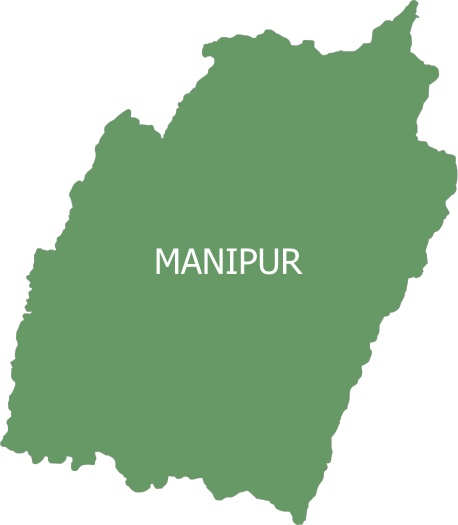

  

<h2 align="center">
  Kangleipak: A Reference
</h2>

Status: Work in progress.

Note: I have just begun to work on this project. More content will be added soon.

### Table of Contents

- Preface
- [Transport](#transport)
- [Language](#language)
- [Cuisine](#cuisine)
- Lodging
- Climate
- History
- Art
- Literature
- Songs, Movies, Dramas, etc
- Places
- Politics
- The People of Kangleipak
- What You Can Speak and What You Can't
- Acknowledgements
- Contributing
- License

### Preface

This guide is written by a mathematician with no formal training in survival tactics anywhere let alone in Kangleipak. Turns out, surviving in Kangleipak isn't hard for a mathematician. If you ain't a mathematician, it will be even easier. Indeed, if you can memorize some sloppy tactics I outline here, you are on the way to enjoy a beautiful ride in Kangleipak. By the way, if you don't already know, 'Kangleipak' is another name of 'Manipur', a state of India.

The first five chapters on transport, language, cuisine, lodging and climate are extreme survival tactics that you desperately need to know in order to keep your organic body intact. The subsequent chapters on history, art and literature will unviel the rich history, art and literature of this beautiful land. The chapter on places talk about, well, the places, of course &mdash; good to know if you are a tourist or traveler. Then there is a chapter on politics and about the beautiful people of this land. In the last chapter, I will train you what you can speak and what you can't!

### Transport

As of 2022, Kangleipak is accessible either by air or road. There is only one airport &mdash; the [Imphal Airport (IMF)](https://en.wikipedia.org/wiki/Imphal_Airport), which likes boasting about being the third busiest airport in northeastern India but the truth is that it's a pretty lazy airport. Kangleipak residents possess the luxury of reaching there within 50 minutes of flight departure and still have some free time before boarding the plane despite being warned to reach the airport 3 hours prior to departure. It is connected to Delhi, Guwahati, Kolkata by direct flights.

The other way to reach Kangleipak is through road transport, which I don't recommend unless you want some hilly adventure and are short on money. I said "some hilly adventure" &mdash; I take it back now. The hilly roads have been plagued with landslides, very rough terrain and mud. There is also a not-so-adventurous history of accidents and deaths of crew?

Having reached Kangleipak, you are in good company. The road transport system is pretty good in the valley. If you venture out farther from the heart of [Imphal](https://en.wikipedia.org/wiki/Imphal) (the capital), you will find the company of holed and cracked roads. If you venture out a lot farther, keep your seatbelts on, it's gonna be a bumpy ride. You can board passenger buses, cabs and autos in most parts of the valley if you know how and what to speak, which brings up the next chapter,

### Language

If you ask me about the official language of Manipur, I'd say 'Meeteilon'. It is written using the [Meetei Script](https://github.com/ronhuidrom/meetei-script). But practically, if you know 'English', you are almost good to go &mdash; well, not very practically if you venture out considerably far from the capital where you are likely to run into mortals that know only Meeteilon.

### Cuisine

We just landed on one of the best things about Kangleipak. The people have a supreme amount of love for fish. Although salt-water fishes are imported to the state, a majority of the people thrive on fresh-water fishes which are provided by a lot of rivers and most prominently by the [Loktak lake](https://en.m.wikipedia.org/wiki/Loktak_Lake). Indeed, the Loktak lake (the largest fresh-water lake in the northeastern India) has been feeding the bellies of the people for centuries. A considerable number of the people has a thing for meat &mdash; chicken, pork, beef, among others. You can even find people who have fed on goat meat, buffalo meat, dog meat, cat meat, and even snakes. 

We have only scratched the surface. The cuisine of the land is much more than fishes and meat. Indeed, it can be argued that the variety and range of fruits, vegetables and cooked foods eaten by the people of the land would rival some of the best of the world. A typical meal include a plate of rice (paddy), curry, *champhut*, *morok metpa*, Chili pepper, *singju* and *eromba*. Some of the iconic cuisines include the following:

1. *Ngari* is a fermented fish product made from sun-dried non-salted fish. It's enormously popular and ubiquitous that almost everyone eats it almost everyday. It is almost always used as an ingredient to making almost every (non-meat) curry.
2. [*Eromba*](https://en.m.wikipedia.org/wiki/Eromba) is almost as popular as *ngari* among Meetei and Meetei Pangal communities. The vegetables (such as potatoes and garlic), spices (such as chilies) and herbs are boiled with or without *ngari* then smashed with hands, whisked with a whisker or blend with a blender.
3. *Champhut* or *Chamfut* is a boiled vegetable/fruit such as a pumpkin, cucumber, carrot or mustard with or without sugar and other ingredients.
4. *Morok metpa* is a coarse paste prepared with green or dry red chilies mixed with chopped onions, coriander leaves and other local herbs for garnishing. The chilies are steamed or roasted with *ngari* or simply crushed and then mashed with salt and *ngari*; fried fish pieces can also be added to it. This is something which accompanies both the meals as a routine side dish.
5. [*Singju*](https://en.m.wikipedia.org/wiki/Singju) is often served as a spicy side dish. It is also popular as an afternoon or evening snack. It is made using either *ngairi* or *thoiding* with vegetables/ingredients which can include lotus, cabbage, cauliflower, banana flower or rice bean, among others.
6. *Chamthong* or *Kangsoi* is a stew of any seasonal vegetables with coarsely chopped onions or spring onion, *maroi*, ginger, *ngari* and salt, topped with *ngari*, dried fish, or fried fish pieces and water. It is soupy in consistency and is eaten with rice.
7. *Kaang-hou* is made from various vegetables stir fried with traditional spices.
8. *Paaknam* is a pancake prepared with a mixture of pea flour, *maroi napaakpi*, *laphu tharo*, *awa phadigom*, and *ngari* wrapped in turmeric and banana leaves and either baked in a pan or steamed first and then roasted for sometime.

### Lodging

### Climate

### History

### Art

### Literature

### Songs, Movies, Dramas, etc

### Places

### Politics

### The People of Kangleipak

### What You Can Speak and What You Can't

### Acknowledgements

### Contributing

If you want to contribute, reach out to [ronhuidrom@gmail.com](mailto:ronhuidrom@gmail.com).

### License

The book is licensed under MIT License.
